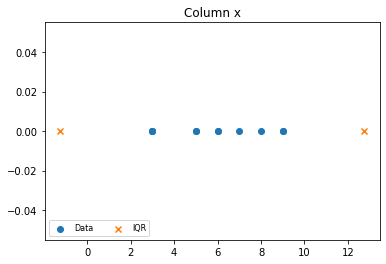
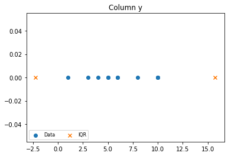
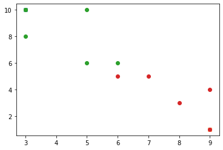
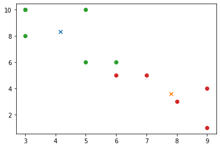

# Clustering (k-means)

## Importing Necessary Library


```python
import pandas as pd
import numpy as np
import random as rn
import matplotlib.pyplot as plt
from random import sample
```

## Data Preparation


```python
data = pd.DataFrame({
    'x':[5, 7, 3, 6, 5, 6, 3, 8, 9, 9, 3],
    'y':[6, 5, 8, 5, 10, 6, 10, 3, 4, 1, 10],
    'cluster':np.zeros(11, np.uint8)
})
data
```


<div>
<style scoped>
    .dataframe tbody tr th:only-of-type {
        vertical-align: middle;
    }

    .dataframe tbody tr th {
        vertical-align: top;
    }

    .dataframe thead th {
        text-align: right;
    }
</style>
<table border="1" class="dataframe">
  <thead>
    <tr style="text-align: right;">
      <th></th>
      <th>x</th>
      <th>y</th>
      <th>cluster</th>
    </tr>
  </thead>
  <tbody>
    <tr>
      <th>0</th>
      <td>5</td>
      <td>6</td>
      <td>0</td>
    </tr>
    <tr>
      <th>1</th>
      <td>7</td>
      <td>5</td>
      <td>0</td>
    </tr>
    <tr>
      <th>2</th>
      <td>3</td>
      <td>8</td>
      <td>0</td>
    </tr>
    <tr>
      <th>3</th>
      <td>6</td>
      <td>5</td>
      <td>0</td>
    </tr>
    <tr>
      <th>4</th>
      <td>5</td>
      <td>10</td>
      <td>0</td>
    </tr>
    <tr>
      <th>5</th>
      <td>6</td>
      <td>6</td>
      <td>0</td>
    </tr>
    <tr>
      <th>6</th>
      <td>3</td>
      <td>10</td>
      <td>0</td>
    </tr>
    <tr>
      <th>7</th>
      <td>8</td>
      <td>3</td>
      <td>0</td>
    </tr>
    <tr>
      <th>8</th>
      <td>9</td>
      <td>4</td>
      <td>0</td>
    </tr>
    <tr>
      <th>9</th>
      <td>9</td>
      <td>1</td>
      <td>0</td>
    </tr>
    <tr>
      <th>10</th>
      <td>3</td>
      <td>10</td>
      <td>0</td>
    </tr>
  </tbody>
</table>
</div>


## Preprocessing

### Describing Data


```python
data_describe  = data.describe()
data_describe
```


<div>
<style scoped>
    .dataframe tbody tr th:only-of-type {
        vertical-align: middle;
    }

    .dataframe tbody tr th {
        vertical-align: top;
    }

    .dataframe thead th {
        text-align: right;
    }
</style>
<table border="1" class="dataframe">
  <thead>
    <tr style="text-align: right;">
      <th></th>
      <th>x</th>
      <th>y</th>
      <th>cluster</th>
    </tr>
  </thead>
  <tbody>
    <tr>
      <th>count</th>
      <td>11.000000</td>
      <td>11.000000</td>
      <td>11.0</td>
    </tr>
    <tr>
      <th>mean</th>
      <td>5.818182</td>
      <td>6.181818</td>
      <td>0.0</td>
    </tr>
    <tr>
      <th>std</th>
      <td>2.272364</td>
      <td>3.027150</td>
      <td>0.0</td>
    </tr>
    <tr>
      <th>min</th>
      <td>3.000000</td>
      <td>1.000000</td>
      <td>0.0</td>
    </tr>
    <tr>
      <th>25%</th>
      <td>4.000000</td>
      <td>4.500000</td>
      <td>0.0</td>
    </tr>
    <tr>
      <th>50%</th>
      <td>6.000000</td>
      <td>6.000000</td>
      <td>0.0</td>
    </tr>
    <tr>
      <th>75%</th>
      <td>7.500000</td>
      <td>9.000000</td>
      <td>0.0</td>
    </tr>
    <tr>
      <th>max</th>
      <td>9.000000</td>
      <td>10.000000</td>
      <td>0.0</td>
    </tr>
  </tbody>
</table>
</div>


## Outlier Detection Using Inter Quartile Range (IQR)


```python
cols = list(data.columns)
cols.remove('cluster')
iqr = {}
for col in cols:
    col_iqr = data_describe[col].loc['75%']-data_describe[col].loc['25%']
    tmp = {}
    tmp['low'] = data_describe[col].loc['25%'] - (col_iqr * 1.5)
    tmp['high'] = data_describe[col].loc['75%'] + (col_iqr * 1.5)
    iqr[col] = tmp 
iqr
```


    {'x': {'low': -1.25, 'high': 12.75}, 'y': {'low': -2.25, 'high': 15.75}}


### Visualizing Data


```python
for col in cols:
    data_plot = plt.scatter(data[col], np.zeros(data[col].size), marker='o')
    iqr_plot = plt.scatter([ iqr[col]['low'], iqr[col]['high'] ], np.zeros(2), marker='x')
    plt.title('Column '+col)
    plt.legend((data_plot, iqr_plot),
               ('Data', 'IQR'),
               scatterpoints=1,
               loc='lower left',
               ncol=3,
               fontsize=8)
    plt.show()
```


    

    


    

    


### Filter Data Using IQR


```python
for col in cols:
    data = data[~((data[col] < iqr[col]['low']) | (data[col]>iqr[col]['high']))]
data
```


<div>
<style scoped>
    .dataframe tbody tr th:only-of-type {
        vertical-align: middle;
    }

    .dataframe tbody tr th {
        vertical-align: top;
    }

    .dataframe thead th {
        text-align: right;
    }
</style>
<table border="1" class="dataframe">
  <thead>
    <tr style="text-align: right;">
      <th></th>
      <th>x</th>
      <th>y</th>
      <th>cluster</th>
    </tr>
  </thead>
  <tbody>
    <tr>
      <th>0</th>
      <td>5</td>
      <td>6</td>
      <td>0</td>
    </tr>
    <tr>
      <th>1</th>
      <td>7</td>
      <td>5</td>
      <td>0</td>
    </tr>
    <tr>
      <th>2</th>
      <td>3</td>
      <td>8</td>
      <td>0</td>
    </tr>
    <tr>
      <th>3</th>
      <td>6</td>
      <td>5</td>
      <td>0</td>
    </tr>
    <tr>
      <th>4</th>
      <td>5</td>
      <td>10</td>
      <td>0</td>
    </tr>
    <tr>
      <th>5</th>
      <td>6</td>
      <td>6</td>
      <td>0</td>
    </tr>
    <tr>
      <th>6</th>
      <td>3</td>
      <td>10</td>
      <td>0</td>
    </tr>
    <tr>
      <th>7</th>
      <td>8</td>
      <td>3</td>
      <td>0</td>
    </tr>
    <tr>
      <th>8</th>
      <td>9</td>
      <td>4</td>
      <td>0</td>
    </tr>
    <tr>
      <th>9</th>
      <td>9</td>
      <td>1</td>
      <td>0</td>
    </tr>
    <tr>
      <th>10</th>
      <td>3</td>
      <td>10</td>
      <td>0</td>
    </tr>
  </tbody>
</table>
</div>


## Processing

### Determine Number of Centroids


```python
c_numb = int(input("Number of Centroids: "))
```

    Number of Centroids: 2


### Define Function For Measuring the Distance Between 2 Vertices


```python
def distance(v1, v2):
    return ((v1-v2)**2).sum()**0.5
```

### Random Centroid


```python
rand_centroid = sample(range(0, data[cols[0]].size),c_numb)
centroids = []
for centroid in rand_centroid:
    centroids.append(list(data[['x','y']].iloc[centroid]))

centroids
```


    [[3, 10], [9, 1]]


### Iteration 1


```python
for i in data.index:
        tmp_dist = []
        for centroid in range(len(centroids)):
            v1 = np.array(data[['x','y']].loc[i])
            v2 = np.array(centroids[centroid])
            tmp_dist.append(distance(v1, v2))
        min_index = tmp_dist.index(min(tmp_dist))
        data.at[i,'cluster'] = min_index
        
# Visualisasi
for centroid in range(len(centroids)):
    plt.scatter(centroids[centroid][0], centroids[centroid][1], marker='x')
    
for cluster in data['cluster'].unique():
    plt.scatter(data[data['cluster']==cluster]['x'], data[data['cluster']==cluster]['y'])
    
# Perbaikan Centroid
centroids = []
for cluster in data['cluster'].unique():
    centroids.append(list(data[data['cluster']==cluster].mean()))
centroids
```


    [[4.166666666666667, 8.333333333333334, 0.0], [7.8, 3.6, 1.0]]


    

    


### Iteration 2


```python
for i in data.index:
        tmp_dist = []
        for centroid in range(len(centroids)):
            v1 = np.array(data[['x','y']].loc[i])
            v2 = np.array(data[['x','y']].iloc[centroid])
            tmp_dist.append(distance(v1, v2))
        min_index = tmp_dist.index(min(tmp_dist))
        data.at[i,'cluster'] = min_index
        
# Visualisasi
for centroid in range(len(centroids)):
    plt.scatter(centroids[centroid][0], centroids[centroid][1], marker='x')
    
for cluster in data['cluster'].unique():
    plt.scatter(data[data['cluster']==cluster]['x'], data[data['cluster']==cluster]['y'])
    
# Perbaikan Centroid
centroids = []
for cluster in data['cluster'].unique():
    centroids.append(list(data[data['cluster']==cluster].mean()))
centroids
```


    [[4.166666666666667, 8.333333333333334, 0.0], [7.8, 3.6, 1.0]]


    

    


### Iteration 3


```python
for i in data.index:
        tmp_dist = []
        for centroid in range(len(centroids)):
            v1 = np.array(data[['x','y']].loc[i])
            v2 = np.array(data[['x','y']].iloc[centroid])
            tmp_dist.append(distance(v1, v2))
        min_index = tmp_dist.index(min(tmp_dist))
        data.at[i,'cluster'] = min_index
        
# Visualisasi
for centroid in range(len(centroids)):
    plt.scatter(centroids[centroid][0], centroids[centroid][1], marker='x')
    
for cluster in data['cluster'].unique():
    plt.scatter(data[data['cluster']==cluster]['x'], data[data['cluster']==cluster]['y'])
    
# Perbaikan Centroid
centroids = []
for cluster in data['cluster'].unique():
    centroids.append(list(data[data['cluster']==cluster].mean()))
centroids
```


    [[4.166666666666667, 8.333333333333334, 0.0], [7.8, 3.6, 1.0]]


    

    


```python

```
